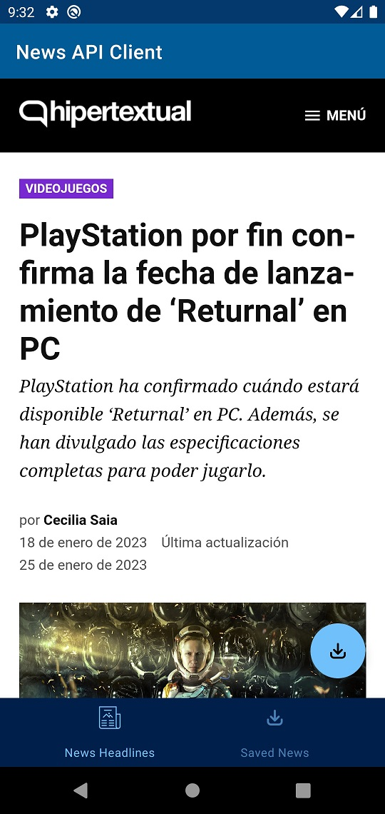

# AS-Kotlin-NewsApiClient
Application that allows you to search and display the most popular news (newsapi.org), with the option of saving the news in the local database.

## Architecture Used
MVVM Architecture

## Libraries
- Retrofit + Gson
- ViewModel + LiveData
- Coroutines
- Hilt
- Navigation Component
- Glide
- Room

## Output
 ### News Headlines page

 ### Searching

 ### News Info page

 ### Saved News page

